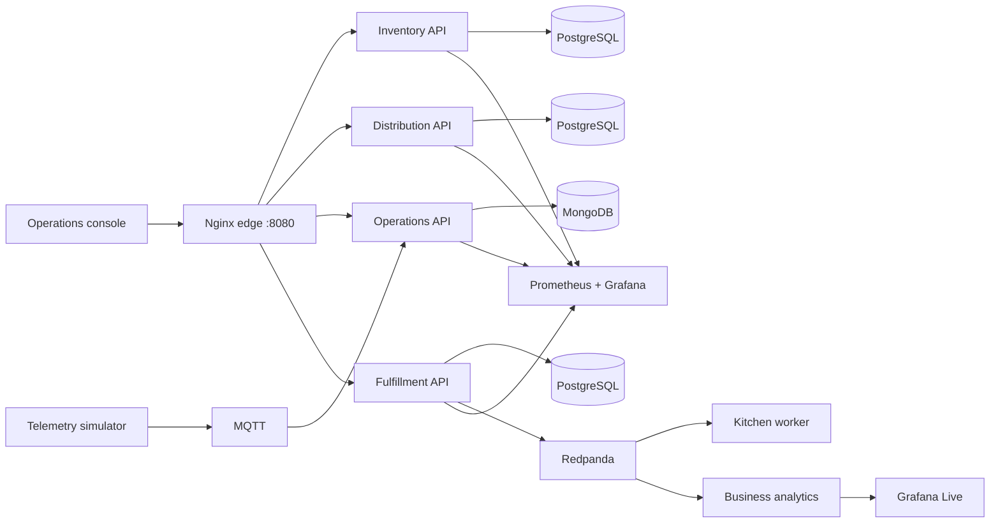

# LogistPulse — Real-time fulfillment and operations

LogistPulse is an event-driven operations platform for a simulated nationwide restaurant and retail network. It connects inventory, distribution, equipment telemetry and kitchen fulfillment so operators can follow an order from acceptance to readiness while the platform measures business risk in real time.

The project is designed as a team portfolio system: it demonstrates service boundaries, polyglot persistence, MQTT and Kafka-compatible streaming, live Grafana views, recovery from partial failures and release controls based on business behavior.

> **Project status:** the platform foundation and integration branch are green. The team is completing the fulfillment event pipeline, recoverable analytics, Grafana Live panels and end-to-end acceptance harness. A separate reference implementation shows the complete target behavior without claiming those contributions for the team.

## Product capabilities

- **Smart Inventory:** stock visibility, replenishment signals and stockout risk.
- **Supply & Distribution:** fleet state, ETA and cold-chain monitoring.
- **Smart Operations:** MQTT equipment telemetry and operational incidents.
- **Order Fulfillment:** an event-driven kitchen queue from `WAITING` to `PREPARING` to `READY`.
- **Business observability:** live overdue-order rate, value at risk and accumulated preparation debt.
- **Platform operations:** health, metrics, container resources and guarded releases.

Stores, orders and monetary values are synthetic. The platform models operational behavior; it is not connected to a real logistics network or payment system.

## Architecture



Each service owns its data. MQTT carries equipment telemetry; Redpanda carries fulfillment commands and confirmed business facts. The analytics component maintains its own recoverable projection instead of querying another service's tables.

See the [architecture overview](docs/architecture/README.md), [C4 container view](docs/architecture/C4-CONTAINER.md) and [data ownership policy](docs/architecture/DATA-OWNERSHIP.md).

## Run locally

Requirements: Docker with Compose v2 and about 8 GB available to Docker.

```bash
cp .env.example .env
docker compose up -d --build --wait
bash scripts/smoke.sh
```

Open <http://localhost:8080> for the operations console.

Start the observability stack separately:

```bash
docker compose -f observability/compose.yaml up -d
```

| Surface | Local URL |
| --- | --- |
| Operations console | <http://localhost:8080> |
| Grafana | <http://localhost:3000> |
| Prometheus | <http://localhost:9090> |
| cAdvisor | <http://localhost:8088> |

The checked-in credentials and all data are for local development only. Follow the [Codespaces guide](docs/CODESPACES.md) for a disposable hosted environment.

## Quality and failure model

Pull requests pass architecture, unit, integration and release checks. Readiness probes verify actual dependencies so an early HTTP proxy response cannot hide a database bootstrap failure. The acceptance contract expands that technical baseline with business invariants, real Grafana rendering, replay and recovery.

The central scenario is an operational **false green**: every container and dependency can report healthy while an accepted order remains stuck before `READY`. The project detects that failure from durable business facts and timers, blocks the revision, then verifies recovery after the correction.

```text
feature branch -> pull request -> automated checks -> teammate review -> squash merge
```

See [CONTRIBUTING](CONTRIBUTING.md) for the workflow and [TEAM-INTEGRATION](docs/TEAM-INTEGRATION.md) for the shared contracts.

## Team

LogistPulse is developed as a shared portfolio project. Credit follows merged code and reviewed evidence; an assignment alone is not treated as a completed contribution.

| Contributor | Workstream |
| --- | --- |
| [Nicolás](https://github.com/nikotov) | Fulfillment rules, event contracts and reliable publication |
| [Daniel Salazar](https://github.com/DanielSalazar0710) | Continuous analytics, deduplication and recoverable state |
| [oandretty010](https://github.com/oandretty010) | Grafana Live adapter, dashboards and reconnect behavior |
| [Roberto Villafuerte](https://github.com/VillaforTech) | Platform integration, Compose, CI and release controls |
| [Daniel Martínez](https://github.com/Dmt-155lbs) | End-to-end, resilience, latency and evidence automation |

The current implementation status and next action for each workstream live in [GitHub Issues](https://github.com/VillaforTech/LOGISTPULSE-GOLDEN_2/issues).

## Engineering documentation

- [Architecture and ownership](docs/architecture/)
- [Incident runbook](docs/runbooks/INCIDENT-001.md)
- [Test plan](docs/TEST-PLAN.md)
- [Observability](observability/README.md)
- [Security policy](SECURITY.md)
- [Release notes](RELEASE-NOTES.md)

## Project context

LogistPulse also serves as a graded software-engineering case study. The course requirements shape the review process, reproducibility, evidence and release-gate scenarios, but the repository is maintained as a standalone portfolio product. Course-specific records remain under `docs/` so the public project story and the assessment trail are both explicit.
