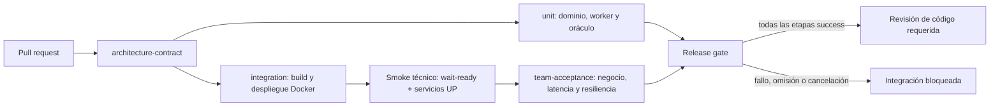

# LogistPulse — aceptación del ciclo del pedido y observabilidad

PR [#7](https://github.com/VillaforTech/logistpulse/pull/7), relacionado con [#5](https://github.com/VillaforTech/logistpulse/issues/5). Harness, oráculo de KPIs y documento: Daniel Martínez (`Dmt-155lbs`). Contrato de eventos e infraestructura: ver la tabla de contribuciones al final. La aprobación del equipo y el envío al aula son pasos separados de la validación técnica.

> **Estado de este documento.** Lo marcado ✅ fue observado en una corrida real y se enlaza a ella. Lo marcado **NO EJECUTADO** describe diseño, no observación, y nombra la dependencia que lo bloquea. Ninguna cifra, URL de corrida ni captura fue inventada. LogistPulse va un paso detrás de BankPulse: el issue #2 no está fusionado en `main` y el #3 no ha entregado adaptador.

## Capacidad y riesgo

La capacidad protegida es: **todo pedido aceptado alcanza `READY` dentro del plazo prometido**. El plazo de laboratorio es `createdAt + 15 s`, compatible con el worker que simula 4 s de preparación. `readyAt` se persiste una sola vez y cada pedido se consulta por su identificador exacto.

El falso verde es un pedido aceptado que queda en `WAITING`/`PREPARING` mientras la infraestructura reporta salud correcta: contenedores arriba, `HTTP 200` en la API, health `UP` de los cuatro servicios. Nada en el semáforo técnico revela que el compromiso con el cliente ya venció.

El riesgo se expresa en unidades monetarias demo mediante L-K2 y en pedido-segundos mediante L-K3. No son ingresos perdidos ni USD: son exposición simulada de laboratorio.

Un antecedente importante: al configurar el equipo, el CI base fallaba al consultar inventario con `HTTP 502` durante el arranque. Eso era una **caída técnica** — el semáforo se puso rojo, que es lo correcto — y **no es el falso verde de negocio**. Quedó corregido en `main` mediante `scripts/wait-ready.py`, que espera disponibilidad real de las APIs antes del smoke.

## Arquitectura y KPIs

API → PostgreSQL con outbox transaccional → Redpanda → analítica independiente con checkpoint → adaptador → Grafana Live → panel. El evento se publica **después** de confirmar el cambio de negocio; un rollback no produce hechos. Los comandos de cocina (`logistpulse.orders`, grupo `kitchen-worker`) viajan por un canal distinto al de los hechos de analítica.

- **L-K1:** `100 × incumplidos / elegibles` con plazo vencido, dentro de la cohorte creada en los últimos 15 min. Sin elegibles: `SIN MUESTRA`. Meta 0%.
- **L-K2:** suma de `total` de todos los pedidos `WAITING`/`PREPARING` con plazo vencido; foto del backlog completo, sin limitar a 15 min. Meta 0.
- **L-K3:** suma de `max(0, ahora − createdAt − 15 s)` de los pedidos aún abiertos, en pedido-segundos. Meta 0.

Los contratos detallados están en [eventos](events-deber-01.md) y [KPIs](kpis-deber-01.md). El oráculo independiente vive en `tests/kpis/logist_kpis.py`, con reloj inyectado y sin red ni base de datos; lo cubren 11 pruebas en `tests/kpis/test_logist_kpis.py`. La fixture de referencia compartida: un pedido de total 25,5 todavía abierto a los 20 s produce **L-K1 = 100 %, L-K2 = 25,5 y L-K3 ≈ 5** pedido-segundos. Un `READY` tardío resuelve valor y deuda pero **no borra** el incumplimiento mientras el pedido siga en la cohorte.



El `Release gate` exige `success` explícito de las etapas previas: una etapa omitida o cancelada **no** pasa. La protección de `main` añade una aprobación vigente del propietario del código, conversaciones resueltas, rama actualizada e historial lineal por *squash and merge*.

## Pruebas y evidencia

| Prueba | Verificación | Estado |
|---|---|---|
| Oráculo de KPIs | L-K1/L-K2/L-K3 con reloj inyectado: fixture 25,5 a los 20 s, caso sano, borde exacto de 15 s, `READY` tardío dentro de cohorte, cohorte vacía y pedido fuera de ventana | ✅ 11 pruebas en verde. Check `Unit and component tests` correcto en la [corrida 35171984807](https://github.com/VillaforTech/logistpulse/actions/runs/35171984807) |
| Negocio | Crea un pedido identificable, lo consulta por `GET /api/fulfillment/orders/{id}`, exige `readyAt` dentro del plazo y verifica que `aggregateVersion` no retroceda | ✅ **Observado en CI** contra el stack real, commit `d51fa05` |
| Latencia de panel | 100 operaciones en Chromium real; `measurementTarget: grafana-render`, cero pérdidas, `quality: FRESH`, p95 ≤ 1000 ms validados por `scripts/check-panel-evidence.py` | **NO EJECUTADO** — depende de #3 |
| Resiliencia | Duplicados, desorden, broker caído con outbox pendiente, reinicio del consumidor antes/después del checkpoint, reconexión de Live | **NO EJECUTADO** — depende de #2 y #3 |
| Deadline sin tráfico | Vencimiento a los 15 s sin nuevos eventos; crecimiento de L-K3 y expiración de cohorte | **NO EJECUTADO** — depende de los temporizadores de #2 |
| Ciclo rojo → bloqueo → verde | Base verde, mutación que omite `READY`, business test rojo con salud `UP`, bloqueo del merge, corrección y verde final | **NO EJECUTADO** — requiere base verde integrada |

La prueba de negocio se ejecutó contra la plataforma desplegada en la [corrida 35171984807](https://github.com/VillaforTech/logistpulse/actions/runs/35171984807/job/105045429595), sobre el commit `d51fa05`, con esta salida literal:

```
[business-test] readiness OK
[business-test] pedido creado: orderId=ORD-B0AE06 estado_inicial=WAITING aggregateVersion=1 total=25.5
RESULTADO: PASS orderId=ORD-B0AE06 estado=READY readyAt=1789609815.70775 plazo=1789609826.470 aggregateVersion=3 t=4.7s
```

El pedido se consultó por identificador exacto, alcanzó `READY` en 4,7 s frente a un plazo de 15 s, `readyAt` quedó persistido y `aggregateVersion` progresó 1 → 3 según el contrato de eventos. Los cuatro servicios reportaron health `UP` antes de medir.

Una actualización perdida **no se excluye** del percentil: hace fallar la prueba. La carga del benchmark es secuencial y no demuestra rendimiento bajo concurrencia ni un SLO de producción.

`scripts/acceptance/run-acceptance.sh` no implementa un gate agregado propio: delega en `scripts/team-acceptance.sh`, que corre con `set -euo pipefail`. Cualquier salida distinta de cero —incluido un `SKIPPED`— detiene la corrida. Esto corrige una versión anterior de este harness que sí producía un PASS agregado cuando la etapa de resiliencia quedaba omitida.

### Bloqueo estructural del check de integración

`docs/TEAM-INTEGRATION.md` establece que, si el repositorio incluye `scripts/acceptance/`, entonces `scripts/team-acceptance.sh` se vuelve obligatorio dentro del check de `integration` y, por tanto, del `Release gate`; error, `SKIPPED` y medición parcial bloquean. Ese contrato hace que este PR **no pueda ponerse verde** mientras falten dos piezas que no pertenecen a #5:

1. **El adaptador de Grafana Live del issue #3 no existe** en `main` ni en ninguna rama remota de este repositorio. Sin panel no hay render que medir.
2. **La CI de LogistPulse no instala Playwright.** En la corrida 35171984807 el benchmark se detuvo con `Cannot find module 'playwright'`. El workflow de BankPulse sí incluye ese paso (`npm install --prefix /tmp/live-browser playwright@1.51.1` y `playwright install --with-deps chromium`, con `NODE_PATH`); el de LogistPulse todavía no.

Ambos puntos están reportados en el PR. Este documento no los presenta como resueltos.

Mientras #3 no esté integrado, `latency_benchmark.py` **falla cerrado**: detecta la ausencia del adaptador, lo informa, y no crea pedidos, no escribe `artifacts/acceptance/latency.json` ni genera muestras sintéticas. Fabricar ese archivo sería precisamente el falso verde que `scripts/check-panel-evidence.py` existe para impedir.

## Reproducción en un entorno limpio

Requisitos: Docker Compose, Python 3 y los recursos declarados en `.devcontainer`. Usar un Codespace o devcontainer **nuevo y desechable**: el harness de resiliencia detiene servicios. No ejecutarlo contra un despliegue compartido.

```bash
cp .env.example .env
docker compose up -d --build
python3 scripts/wait-ready.py
bash scripts/smoke.sh

python3 -m pip install --break-system-packages -r requirements-test.txt
python3 -m pytest tests/kpis -q

docker compose -f observability/compose.yaml up -d prometheus grafana
bash scripts/acceptance/run-acceptance.sh
```

Grafana queda en `http://localhost:3000` y Prometheus en `http://localhost:9090`; las credenciales de laboratorio están en la configuración de observabilidad. Conservar `artifacts/` antes de cerrar el entorno.

Los pasos que dependen de #2 y #3 —levantar `compose.analytics.yaml`, el adaptador de Grafana Live y el benchmark de panel— se añadirán a este bloque cuando esas ramas se fusionen. Hoy `run-acceptance.sh` se detiene en la etapa de latencia con el motivo explícito.

## Ciclo de bloqueo y recuperación

**NO EJECUTADO.** El ciclo completo requiere una base verde integrada, que a su vez requiere #2 y #3 en `main`. El diseño acordado es:

1. **Base verde.** Corrida con los cuatro checks en verde sobre un commit identificado, registrando el `run id` y el SHA probado.
2. **Mutación acotada.** Una rama de demostración omite la transición a `READY` únicamente para la fixture, manteniendo vivos el worker, el broker, la base de datos, las APIs y la captura de hechos. **No** se apaga un contenedor: eso sería una caída técnica, no un falso verde.
3. **Tecnología UP, negocio incorrecto.** Docker, smoke técnico y health pasan; el business test registra el pedido sin `readyAt` dentro del plazo y L-K1 = 100 % con L-K2 = 25,5.
4. **Bloqueo.** El job `Release gate` falla y GitHub marca el PR como bloqueado. La regresión **nunca** se integra a `main`; se observa el bloqueo sin intentar fusionar.
5. **Diagnóstico y corrección.** Se restaura la transición y se vuelve a ejecutar con las mismas pruebas, enlazando las tres corridas: verde base, roja y verde final.

Antecedente ya observado y conservado como contexto, **no** como el falso verde del deber: la corrida de CI del PR #7 anterior al merge con `main` falló en `[2/6] inventory` con `HTTP 502` durante el arranque. Era el defecto de bootstrap documentado en `CONTRIBUTING.md`, corregido después por #4 con `scripts/wait-ready.py`.

### Correspondencia con el enunciado

| Criterio | Puntos | Evidencia |
|---|---:|---|
| Riesgo convertido en prueba computable | 3 | Capacidad y falso verde definidos; L-K1/L-K2/L-K3 con fórmula, población y umbral; oráculo con 11 pruebas en verde y prueba de negocio `PASS` observada en CI sobre el stack desplegado |
| Release Gate funcional | 5 | Diagrama y workflow de cuatro etapas; `team-acceptance.sh` como runner único, con `architecture-contract` y `Unit and component tests` en verde; **pendiente** la etapa de integración completa, bloqueada por #3 y por la falta de Playwright en la CI |
| Diagnóstico y recuperación reproducible | 2 | Comandos de reproducción desde Codespace limpio; **pendiente** el diff de la mutación y la corrida correctiva |

El archivo requerido es `docs/deber-01.md`. Una ejecución local no acredita una prueba en Codespaces ni una reproducción independiente por otro integrante. El envío al aula se confirma aparte con su recibo.

### Contribuciones

| Trabajo | Autor / PR |
|---|---|
| Contrato de eventos, `readyAt`, consulta por `orderId` y KPIs | Nicolás Tovar (`nikotov`) / [#8](https://github.com/VillaforTech/logistpulse/pull/8) |
| Analítica persistente y temporizadores | Daniel Salazar (`DanielSalazar0710`) / rama `feat/2-business-analytics`, sin fusionar |
| Grafana Live y visualización de alertas | `oandretty010` / adaptador de Grafana Live no presente en `main` ni en ninguna rama remota a la fecha |
| Infraestructura, integración y Release Gate | Roberto Villafuerte (`VillaforTech`) / [#10](https://github.com/VillaforTech/logistpulse/pull/10) |
| Harness de aceptación, oráculo de KPIs y este documento | Daniel Martínez (`Dmt-155lbs`) / [#7](https://github.com/VillaforTech/logistpulse/pull/7) |

Esta tabla refleja lo que está en el repositorio al momento de escribirla. No acredita trabajo futuro, disponibilidad ni revisiones pendientes; cada PR y sus commits conservan la atribución real.
